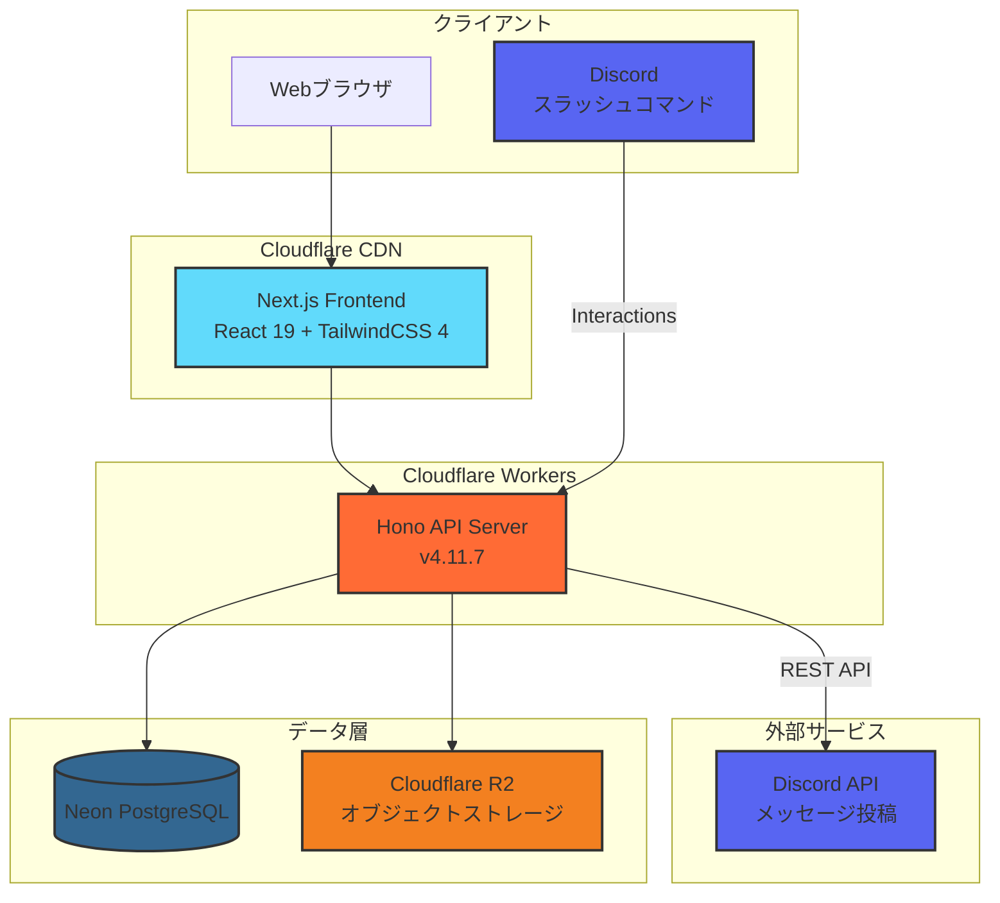
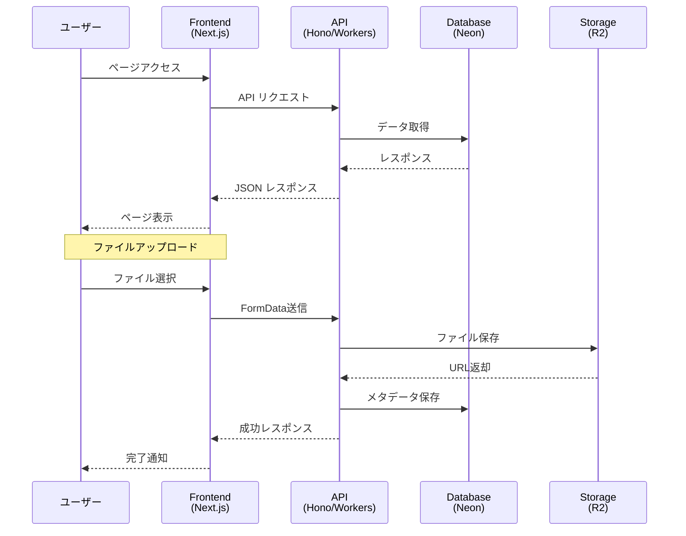
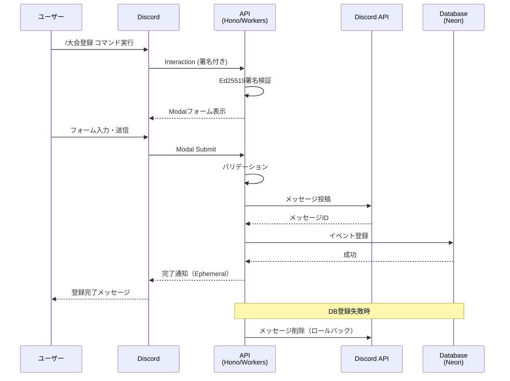
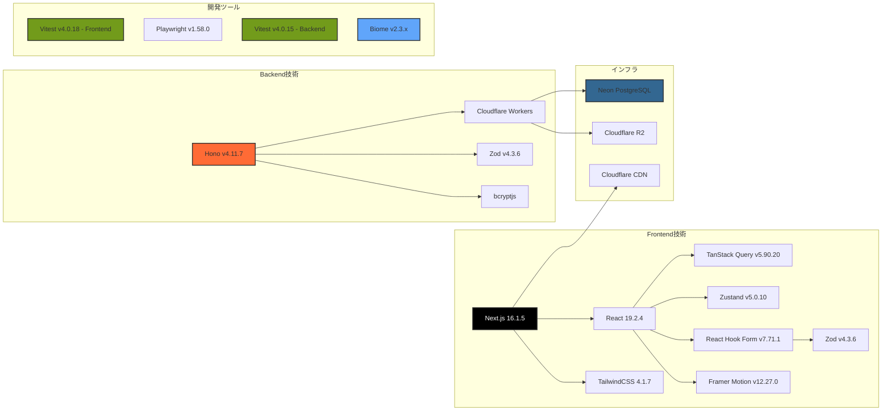

# Project Europa

Cloudflare Workers + HonoバックエンドとNext.jsフロントエンドで構成されるWebアプリケーション。

> **注記**: このプロジェクトは以前Laravel（PHP 8.4、Laravel 11.x）やDocker Composeを使用していましたが、現在はCloudflare Workers + Honoアーキテクチャに完全に移行し、Docker Composeは廃止されました。

## アーキテクチャ



## クイックスタート

### 前提条件

- **Node.js:** v24.13.0 以上（[Volta](https://volta.sh/) 推奨）
- **パッケージマネージャー:** npm（プロジェクト標準）
- **Wrangler CLI:** Cloudflare Workers のデプロイに必要

### セットアップ

```bash
# バックエンド
cd hono-worker
npm install
cp .dev.vars.example .dev.vars  # 環境変数を設定
npm run dev

# フロントエンド（別ターミナル）
cd frontend
npm install
cp .env.local.example .env.local  # 環境変数を設定
npm run dev  # http://localhost:3002
```

## プロジェクト構成

```
.
├── hono-worker/         # Cloudflare Workers + Hono バックエンド
│   ├── src/
│   ├── wrangler.toml
│   └── CLAUDE.md        # 開発ガイド・コマンド・API仕様
├── frontend/            # Next.js フロントエンド
│   ├── src/
│   ├── e2e/
│   └── CLAUDE.md        # 開発ガイド・コマンド・E2Eテスト規約
├── CLAUDE.md            # プロジェクト全体の開発ガイド
└── README.md
```

## データフロー



## Discord Bot連携

EuropaはDiscord Botと連携して、Discordから直接大会情報を登録できます。

- `/大会登録` スラッシュコマンドでModalフォームを表示
- Discordチャンネルへの告知投稿（Embed形式）
- Europaのeventsテーブルへの自動登録



### Discord Bot環境変数

```bash
# Discord Developer Portalから取得
DISCORD_APPLICATION_ID=xxxx
DISCORD_PUBLIC_KEY=xxxx
DISCORD_BOT_TOKEN=xxxx
DISCORD_GUILD_ID=xxxx
DISCORD_CHANNEL_ID=xxxx  # フォールバック用
```

## 技術スタック詳細

> **凡例**: このグラフは技術スタック全体の可視化であり、実行時依存関係を示すものではありません。テストツール（Vitest/Playwright）はdevDependenciesです。



## 詳細ドキュメント

| サブプロジェクト | ドキュメント | 内容 |
|----------------|-------------|------|
| hono-worker | [CLAUDE.md](hono-worker/CLAUDE.md) | API設計、DB構造、認証、Discord連携 |
| frontend | [CLAUDE.md](frontend/CLAUDE.md) | コンポーネント設計、状態管理、E2Eテスト規約 |
