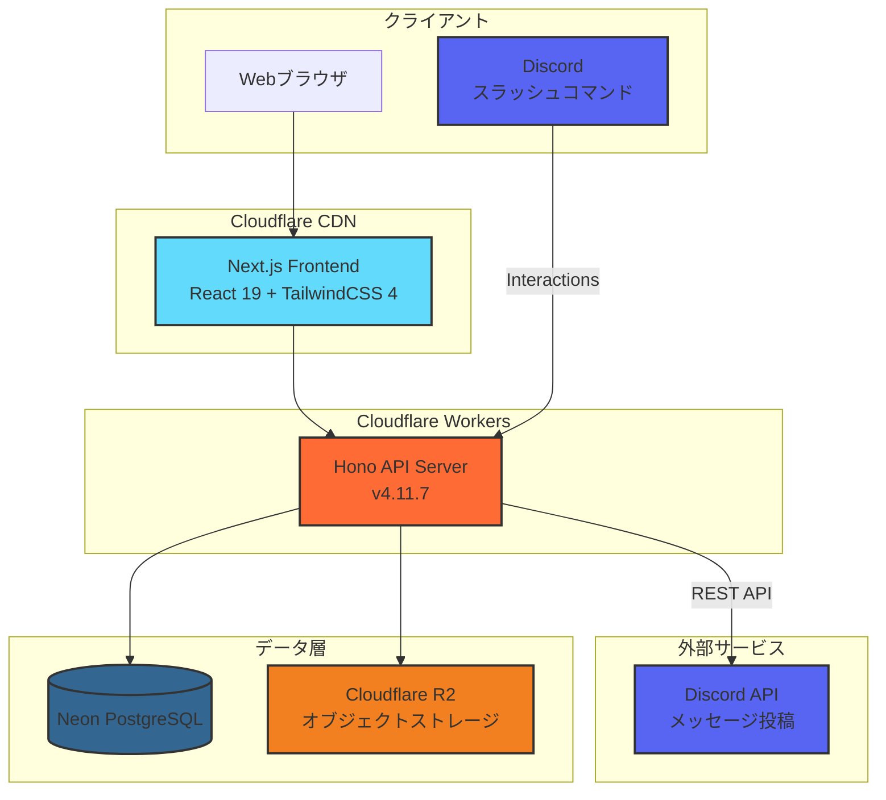
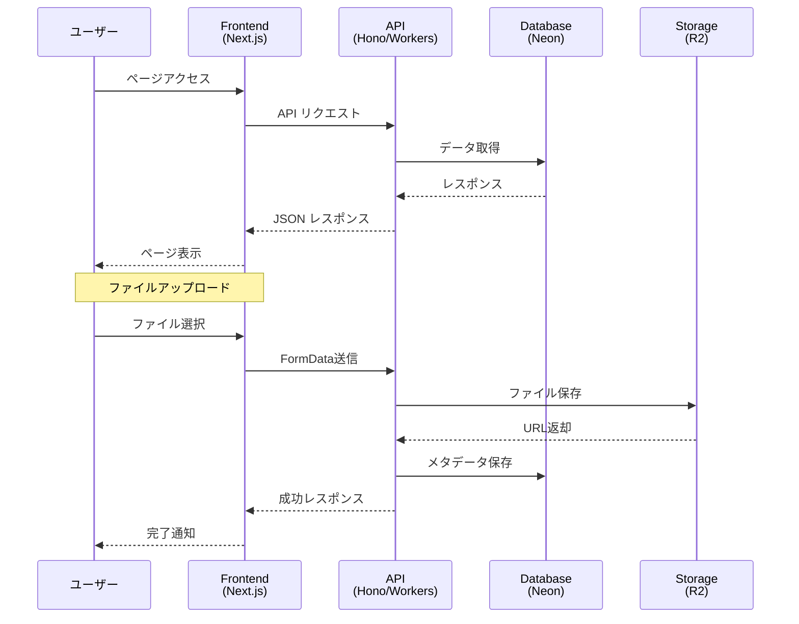
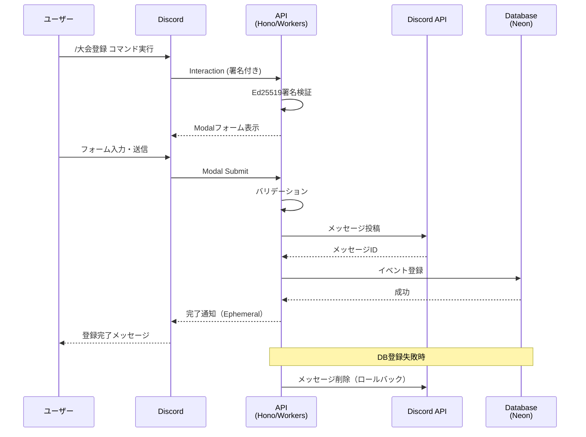
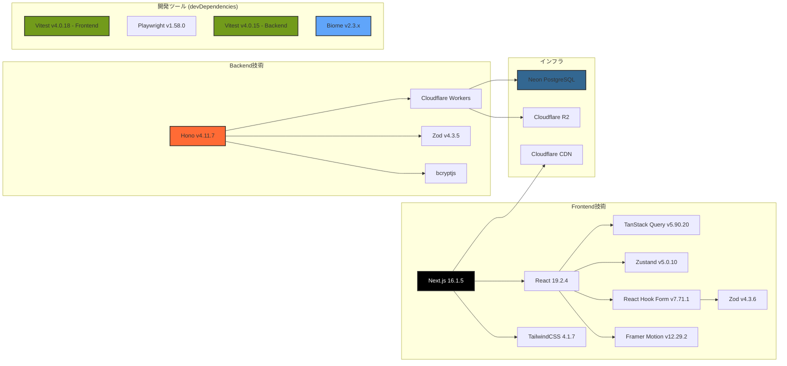

# Project Europa

Cloudflare Workers + HonoバックエンドとNext.jsフロントエンドで構成されるWebアプリケーション。

> **注記**: このプロジェクトは以前Laravel（PHP 8.4、Laravel 11.x）やDocker Composeを使用していましたが、現在はCloudflare Workers + Honoアーキテクチャに完全に移行し、Docker Composeは廃止されました。

## アーキテクチャ


```mermaid
graph TB
    subgraph "クライアント"
        Browser[Webブラウザ]
        Discord[Discord<br/>スラッシュコマンド]
    end

    subgraph "Cloudflare CDN"
        Frontend[Next.js Frontend<br/>React 19 + TailwindCSS 4]
    end

    subgraph "Cloudflare Workers"
        API[Hono API Server<br/>v4.11.7]
    end

    subgraph "外部サービス"
        DiscordAPI[Discord API<br/>メッセージ投稿]
    end

    subgraph "データ層"
        DB[(Neon PostgreSQL)]
        R2[Cloudflare R2<br/>オブジェクトストレージ]
    end

    Browser --> Frontend
    Frontend --> API
    Discord -->|Interactions| API
    API --> DB
    API --> R2
    API -->|REST API| DiscordAPI

    style Frontend fill:#61dafb,stroke:#333,stroke-width:2px
    style API fill:#ff6b35,stroke:#333,stroke-width:2px
    style DB fill:#336791,stroke:#333,stroke-width:2px
    style R2 fill:#f38020,stroke:#333,stroke-width:2px
    style Discord fill:#5865F2,stroke:#333,stroke-width:2px
    style DiscordAPI fill:#5865F2,stroke:#333,stroke-width:2px
```

## クイックスタート

### 前提条件

- **Node.js:** v24.13.0 以上（[Volta](https://volta.sh/) 推奨）
- **パッケージマネージャー:** npm（プロジェクト標準）
- **Wrangler CLI:** Cloudflare Workers のデプロイに必要

### セットアップ

```bash
# バックエンド
cd hono-worker
npm install
cp .dev.vars.example .dev.vars  # 環境変数を設定
npm run dev

# フロントエンド（別ターミナル）
cd frontend
npm install
cp .env.local.example .env.local  # 環境変数を設定
npm run dev  # http://localhost:3002
```

> 📖 環境変数の詳細設定やコマンドリファレンスは、各サブプロジェクトの [CLAUDE.md](hono-worker/CLAUDE.md) / [CLAUDE.md](frontend/CLAUDE.md) を参照してください。

## RTK の安全な試用

RTK は [rtk-ai/rtk](https://github.com/rtk-ai/rtk) で公開されている外部 CLI です。公式 README では、LLM に渡るコマンド出力を圧縮して token 消費を削減する Rust 製の CLI proxy と説明されています。公式サイトは [https://www.rtk-ai.app](https://www.rtk-ai.app) です。GitHub 上では repository navigation に `Apache-2.0 license` が表示され、README badge には `License: MIT` も表示されているため、利用前に対象 version の repository と release artifact でライセンス表示を確認してください。

この repository には RTK 本体やインストーラーは含めません。使用前に、チームで承認した公式 URL、ライセンス、バージョン、配布物の SHA256 を確認し、その値を環境変数で明示してください。承認済みの配布元とハッシュがない状態では使わないでください。

RTK は global hook としては使わず、PR レビュー前に巨大 diff をざっと読む補助だけに限定します。この repo では [`scripts/rtk-safe.sh`](scripts/rtk-safe.sh#L1) 経由で実行してください。PATH 上の `rtk` は使用せず、検証済み binary の絶対パスを `RTK_BIN` で指定します。

```bash
export RTK_BIN=/absolute/path/to/rtk
export RTK_SOURCE_URL=https://github.com/rtk-ai/rtk/releases/tag/<version>
export RTK_VERSION=x.y.z
export RTK_SHA256=<sha256-of-RTK_BIN>
```

```bash
./scripts/rtk-safe.sh git diff
./scripts/rtk-safe.sh git diff master...HEAD
./scripts/rtk-safe.sh git status
```

この wrapper は `RTK_TELEMETRY_DISABLED=1` と `RTK_TEE=0` を強制し、実行前に `RTK_BIN` の SHA256 を検証します。`rtk init` や hook 操作は許可コマンド外として拒否され、`--global`、`aws`、`gh`、`curl`、`wget`、`docker`、`kubectl`、`.env`、`credentials`、secret/token/password を含む引数、CI での実行も拒否します。許可コマンドは `git diff/status/log/show` と `npm test` だけです。`git log -g` のように許可コマンド内で意味を持つ `-g` はブロックしません。

## プロジェクト構成

```text
.
├── hono-worker/         # Cloudflare Workers + Hono バックエンド
│   ├── src/
│   ├── wrangler.toml
│   └── CLAUDE.md        # 開発ガイド・コマンド・API仕様
├── frontend/            # Next.js フロントエンド
│   ├── src/
│   ├── e2e/
│   └── CLAUDE.md        # 開発ガイド・コマンド・E2Eテスト規約
├── CLAUDE.md            # プロジェクト全体の開発ガイド
└── README.md
```

## データフロー


```mermaid
sequenceDiagram
    participant U as ユーザー
    participant F as Frontend<br/>(Next.js)
    participant A as API<br/>(Hono/Workers)
    participant D as Database<br/>(Neon)
    participant S as Storage<br/>(R2)

    U->>F: ページアクセス
    F->>A: API リクエスト
    A->>D: データ取得
    D-->>A: レスポンス
    A-->>F: JSON レスポンス
    F-->>U: ページ表示

    Note over U,F: ファイルアップロード
    U->>F: ファイル選択
    F->>A: FormData送信
    A->>S: ファイル保存
    S-->>A: URL返却
    A->>D: メタデータ保存
    A-->>F: 成功レスポンス
    F-->>U: 完了通知
```

## Discord Bot連携

EuropaはDiscord Botと連携して、Discordから直接大会情報を登録できます。

- `/大会登録` スラッシュコマンドでModalフォームを表示
- Discordチャンネルへの告知投稿（Embed形式）
- Europaのeventsテーブルへの自動登録


```mermaid
sequenceDiagram
    participant U as ユーザー
    participant DC as Discord
    participant A as API<br/>(Hono/Workers)
    participant DA as Discord API
    participant D as Database<br/>(Neon)

    U->>DC: /大会登録 コマンド実行
    DC->>A: Interaction (署名付き)
    A->>A: Ed25519署名検証
    A-->>DC: Modalフォーム表示

    U->>DC: フォーム入力・送信
    DC->>A: Modal Submit
    A->>A: バリデーション
    A->>DA: メッセージ投稿
    DA-->>A: メッセージID
    A->>D: イベント登録
    D-->>A: 成功
    A-->>DC: 完了通知（Ephemeral）
    DC-->>U: 登録完了メッセージ

    Note over A,D: DB登録失敗時
    A->>DA: メッセージ削除（ロールバック）
```

### Discord Bot環境変数

```bash
# Discord Developer Portalから取得
# ⚠️ 以下はすべて機密情報です。リポジトリにコミットせず、環境変数または.dev.varsで管理してください。
DISCORD_APPLICATION_ID=xxxx    # 機密: アプリケーションID
DISCORD_PUBLIC_KEY=xxxx        # 機密: 署名検証用公開鍵
DISCORD_BOT_TOKEN=xxxx         # 機密: Botトークン（最重要）
DISCORD_GUILD_ID=xxxx          # 非公開推奨: サーバーID
DISCORD_CHANNEL_ID=xxxx        # 非公開推奨: フォールバック用チャンネルID
```

## 技術スタック詳細

> **凡例**: このグラフは技術スタック全体の可視化であり、実行時依存関係を示すものではありません。テストツール（Vitest/Playwright）はdevDependenciesです。


```mermaid
graph LR
    subgraph "Frontend技術"
        NextJS["Next.js 16.1.5"]
        React["React 19.2.4"]
        TailwindCSS["TailwindCSS 4.1.7"]
        TanStack["TanStack Query v5.90.20"]
        Zustand["Zustand v5.0.10"]
        RHF["React Hook Form v7.71.1"]
        ZodFE["Zod v4.3.6"]
        Framer["Framer Motion v12.29.2"]
    end

    subgraph "Backend技術"
        Hono["Hono v4.11.7"]
        Workers["Cloudflare Workers"]
        Zod["Zod v4.3.5"]
        Bcrypt["bcryptjs"]
    end

    subgraph "インフラ"
        Neon["Neon PostgreSQL"]
        R2["Cloudflare R2"]
        CF["Cloudflare CDN"]
    end

    subgraph "開発ツール (devDependencies)"
        VitestFE["Vitest v4.0.18 - Frontend"]
        PlaywrightFE["Playwright v1.58.0"]
        VitestBE["Vitest v4.0.15 - Backend"]
        Biome["Biome v2.3.x"]
    end

    NextJS --> React
    NextJS --> TailwindCSS
    React --> TanStack
    React --> Zustand
    React --> RHF
    RHF --> ZodFE
    React --> Framer

    Hono --> Workers
    Hono --> Zod
    Hono --> Bcrypt

    Workers --> Neon
    Workers --> R2
    NextJS --> CF

    style NextJS fill:#000,color:#fff,stroke:#333,stroke-width:2px
    style Hono fill:#ff6b35,stroke:#333,stroke-width:2px
    style Neon fill:#336791,stroke:#333,stroke-width:2px
    style VitestFE fill:#729b1b,stroke:#333,stroke-width:2px
    style VitestBE fill:#729b1b,stroke:#333,stroke-width:2px
    style Biome fill:#60a5fa,stroke:#333,stroke-width:2px
```

## 詳細ドキュメント

| サブプロジェクト | ドキュメント | 内容 |
|----------------|-------------|------|
| hono-worker | [CLAUDE.md](hono-worker/CLAUDE.md) | API設計、DB構造、認証、Discord連携 |
| frontend | [CLAUDE.md](frontend/CLAUDE.md) | コンポーネント設計、状態管理、E2Eテスト規約 |
