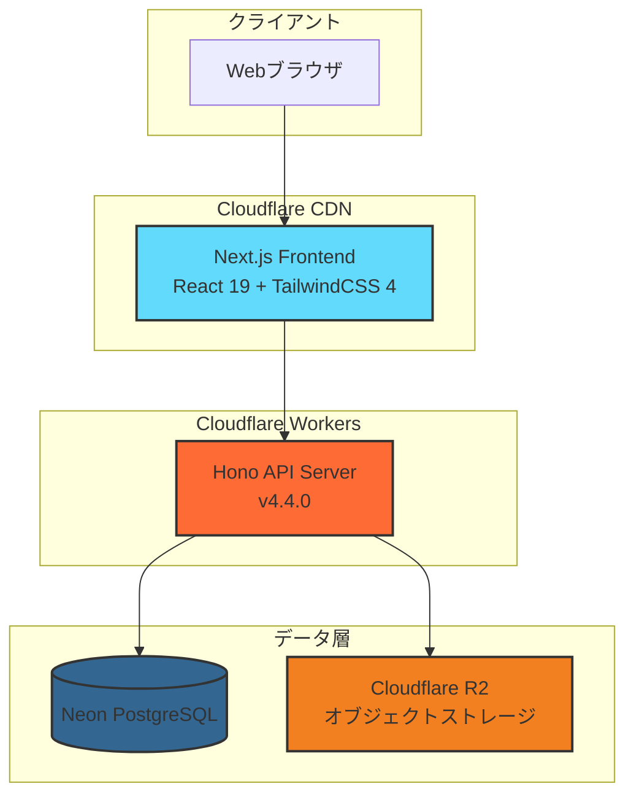
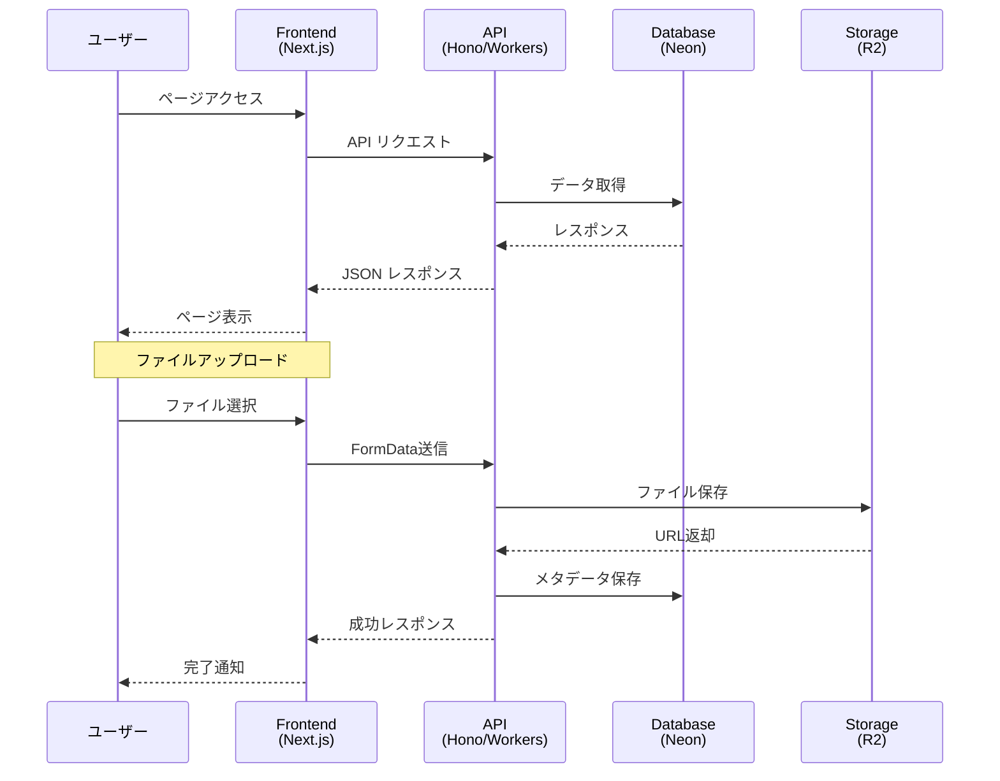

# Project Europa

このリポジトリは、Cloudflare Workers + HonoバックエンドとNext.jsフロントエンドで構成されるProject Europaのコードベースを含んでいます。

> **注記**: このプロジェクトは以前Laravel（PHP 8.4、Laravel 11.x）を使用していましたが、現在はCloudflare Workers + Honoアーキテクチャに移行しています。

## 現在の構成

### hono-worker (バックエンド)
Cloudflare Workers上で動作するHonoベースのバックエンドAPI

### frontend (フロントエンド)
Next.js 15.xベースのフロントエンドアプリケーション

## 技術スタック

### バックエンド (hono-worker)
*   **ランタイム:** Cloudflare Workers
*   **フレームワーク:** Hono v4.4.0
*   **データベース:** Neon (PostgreSQL)
*   **ストレージ:** Cloudflare R2
*   **バリデーション:** Zod v4.1.13
*   **認証:** bcryptjs

### フロントエンド (frontend)
*   **Next.js:** 15.4.8
*   **React:** 19.0.0
*   **スタイリング:** TailwindCSS 4.1.7
*   **UIコンポーネント:** shadcn/ui, Radix UI
*   **状態管理:** Zustand
*   **データフェッチング:** TanStack Query v5.83.0
*   **フォーム:** React Hook Form
*   **バリデーション:** Zod v4.0.5
*   **アニメーション:** Framer Motion

## 環境構築手順

### hono-worker のセットアップ

1.  **hono-workerディレクトリに移動:**
    ```bash
    cd hono-worker
    ```

2.  **依存関係のインストール:**
    ```bash
    npm install
    ```

3.  **環境変数の設定:**
    ```bash
    cp .dev.vars.example .dev.vars
    ```
    `.dev.vars`ファイルを編集して、必要な環境変数を設定してください。

4.  **開発サーバーの起動:**
    ```bash
    npm run dev
    ```

### frontend のセットアップ

1.  **frontendディレクトリに移動:**
    ```bash
    cd frontend
    ```

2.  **依存関係のインストール:**
    ```bash
    npm install
    ```

3.  **環境変数の設定:**
    ```bash
    cp .env.local.example .env.local
    ```
    `.env.local`ファイルを編集して、必要な環境変数を設定してください。（例: `NEXT_PUBLIC_API_BASE_URL`）

4.  **開発サーバーの起動:**
    ```bash
    npm run dev
    ```
    デフォルトで `http://localhost:3002` で起動します。

## 開発用コマンド

### hono-worker

```bash
# 開発サーバー起動
npm run dev

# テスト実行
npm run test
npm run test:ui          # UIモードでテスト
npm run test:coverage    # カバレッジ付きテスト

# コード品質チェック
npm run lint             # Lint実行
npm run lint:fix         # Lint自動修正
npm run format           # フォーマットチェック
npm run format:fix       # フォーマット自動修正
npm run check            # Lint + フォーマットチェック
npm run check:fix        # Lint + フォーマット自動修正

# デプロイ
npm run deploy:staging   # ステージング環境へデプロイ
npm run deploy:production # 本番環境へデプロイ
```

### frontend

```bash
# 開発サーバー起動
npm run dev

# ビルド
npm run build
npm start                # 本番ビルド起動

# テスト実行
npm run test
npm run test:ui          # UIモードでテスト
npm run test:coverage    # カバレッジ付きテスト
npm run test:e2e         # E2Eテスト (Playwright)
npm run test:e2e:ui      # E2EテストUIモード

# コード品質チェック
npm run lint             # Lint実行
npm run lint:fix         # Lint自動修正
npm run format           # フォーマットチェック
npm run format:fix       # フォーマット自動修正
npm run check            # Lint + フォーマットチェック
npm run check:fix        # Lint + フォーマット自動修正
npm run type-check       # TypeScriptの型チェック

# その他
npm run analyze          # バンドルサイズ分析
npm run clean            # キャッシュクリア
```

## プロジェクト構成

```
.
├── hono-worker/         # Cloudflare Workers + Hono バックエンド
│   ├── src/
│   ├── scripts/
│   ├── wrangler.toml
│   └── package.json
├── frontend/            # Next.js フロントエンド
│   ├── src/
│   ├── public/
│   ├── e2e/
│   └── package.json
└── readme.md
```

## アーキテクチャ

### システム全体構成



### データフロー



### 技術スタック詳細


